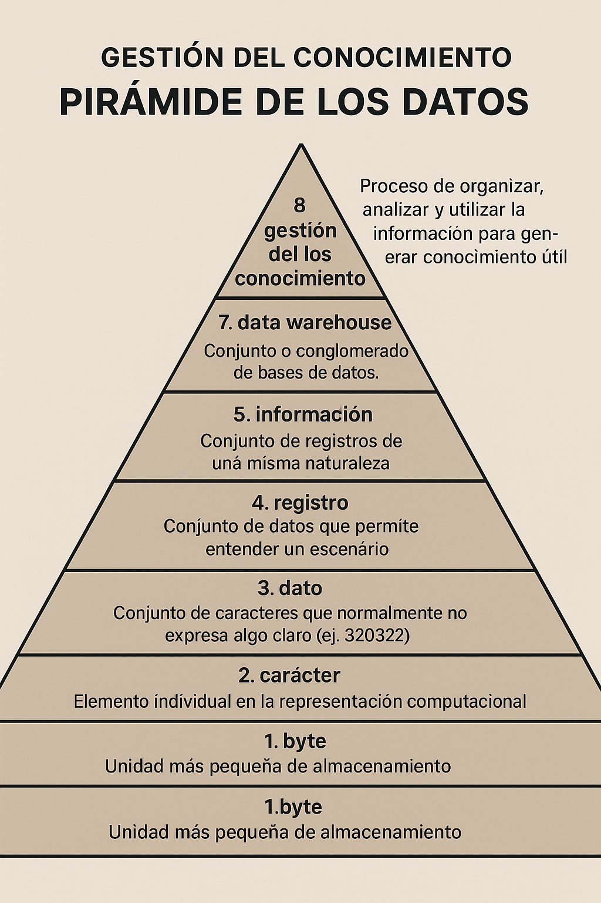
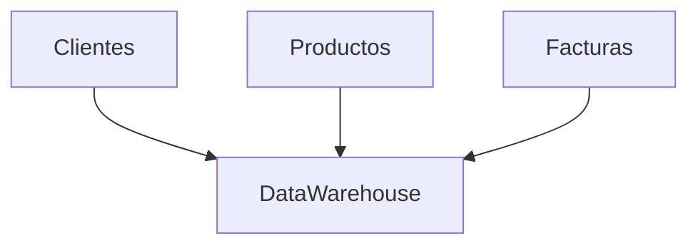

## Jerarquía de los Datos

La jerarquía de los datos representa los diferentes niveles en los que la información se organiza dentro de los sistemas informáticos. Cada nivel tiene una función específica y permite estructurar la información de manera eficiente.

### 1. Byte
**Definición:** Es la unidad más pequeña de almacenamiento en un sistema digital, compuesta por 8 bits. Permite representar un solo carácter o símbolo.

### 2. Carácter
**Definición:** Es un elemento individual, como una letra, número o símbolo, que se representa en la computadora mediante un byte.

### 3. Dato
**Definición:** Es un conjunto de caracteres que, por sí solo, puede no tener significado claro. Ejemplo: `320322`.

### 4. Registro
**Definición:** Es un conjunto de datos relacionados que describen una entidad o escenario específico.

**Ejemplo de registro:**

| Nombre | Apellido | Teléfono | Edad |
|--------|----------|----------|------|
| Pedro  | Gomez    | 3212020  | 32   |

### 5. Información
**Definición:** Es el conjunto de registros de una misma naturaleza, que permite comprender y analizar un fenómeno o situación.

**Ejemplo de información:**

| Nombre  | Apellido | Teléfono | Edad |
|---------|----------|----------|------|
| Pedro   | Gomez    | 3212020  | 32   |
| Daniel  | Lopez    | 12344    | 21   |
| Sofia   | Gonzalez | 3214     | 43   |
| Camilo  | Motta    | 12345    | 23   |

---

## 6. Base de Datos
**Definición:** Es un conjunto organizado de entidades (información sobre comportamientos, objetos o personas) que están correlacionadas entre sí y permiten el almacenamiento, consulta y gestión eficiente de los datos.

**Ejemplo de base de datos de clientes:**

| Nombre  | Apellido | Código Cliente | Teléfono | Edad |
|---------|----------|---------------|----------|------|
| Pedro   | Gomez    | 32002         | 3212020  | 32   |
| Daniel  | Lopez    | 36366         | 12344    | 21   |
| Sofia   | Gonzalez | 53532         | 3214     | 43   |
| Camilo  | Motta    |               | 12345    | 23   |

**Ejemplo de base de datos de productos:**

| Nombre   | Código Producto | Precio     | Descripción                |
|----------|----------------|-----------:|----------------------------|
| TV       | 55463          | 3,000,000  | Televisor de pantalla      |
| Mouse    | 63532          |   120,000  | Mouse óptico               |
| Teclado  | 77493          |   130,000  | Teclado mecánico           |
| Tablet   |                | 2,000,000  | Tablet de última generación|

**Ejemplo de base de datos de facturas:**

| Fecha       | Total Pagar | Código Cliente | Código Producto | Cantidad |
|-------------|------------:|---------------|----------------|---------:|
| 11/02/2025  | 3,000,000   | 2345          | 879            | 23       |
| 12/02/2025  | 2,000,000   | 2354          | 324            | 43       |
| 13/02/2025  | 3,500,000   | 6543          | 567            | 56       |
|             |             |               |                | 34       |

---

## 7. Data Warehouse
**Definición:** Es un conjunto o conglomerado de bases de datos que se integran para facilitar el análisis y la toma de decisiones. Permite almacenar grandes volúmenes de información histórica y realizar consultas complejas.

**Representación gráfica:**

---

## 8. Gestión del Conocimiento (Knowledge Management)
**Definición:** Es el proceso de capturar, organizar, compartir y analizar el conocimiento dentro de una organización para mejorar la toma de decisiones y la eficiencia. Incluye la gestión de datos, información y experiencias.

**Tabla de procesos de gestión del conocimiento:**

| Proceso           | Descripción                                      |
|-------------------|--------------------------------------------------|
| Captura           | Recolección de datos y experiencias              |
| Organización      | Clasificación y estructuración del conocimiento  |
| Compartir         | Difusión y acceso al conocimiento                |
| Análisis          | Evaluación y uso para la toma de decisiones      |

    6-Base de datos: Conjunto de entidades (la información de un comportamiento), que normalmente estan correlacionadas entre si.

    Datos basicos
    ------------------------------------------------------
        *Nombre:Pedro | Daniel | Sofia | Camilo
        *Apellido:Gomez | Lopez |Gonzalez | Motta
        *Código cliente: 32002 | 36366 | 53532
        *Telefono:3212020 | 12344 |3214 |12345
        *Edad:32 | 21 | 43 | 23

    Productos
    ---------------------------------------------------
        *Nombre: TV | Mouse | Teclado | Tablet
        *Código producto: 55463 | 63532 | 77493
        *Precio: 3,000.000 | 120.000 | 130.000 | 2,000.000
        *Descripción: Televisor de pantalla

    Factura 
    ---------------------------------------------
        *Fecha: 11/02/2025| 12/02/2025 | 13/02/2025  
        *Total pagar: 3,000.000  | 2.000.000 | 3.500.000
        *Codigo cliente: 2345 | 2354 | 6543
        *Codigo producto: 879 | 324 | 567 
        *Cantidad:23 | 43 | 56 | 34

    7-Data where house: Conjunto o clongomerado de base de datos
    -----------------------------------

    8-Gestión de conocimiento (knowledge management)

